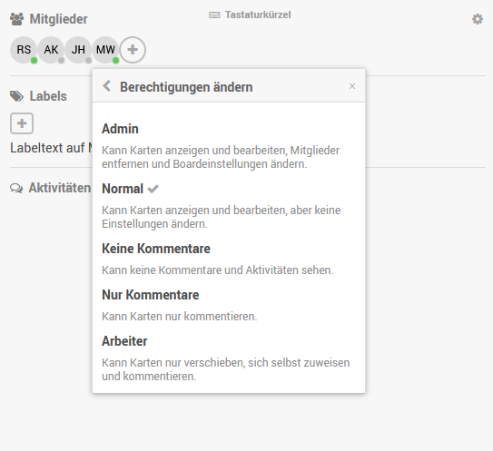

# oa-wfms
Demo code for a workflow management solution for open access publishers

Version 1.0
Date: 7.11.2025

## Resources

- Wekan API reference: https://wekan.fi/api/v7.93/#wekan-rest-api
- OJS API reference: https://docs.pkp.sfu.ca/dev/api/ojs/3.3

## Installation

Clone repo. From inside the cloned folder run:

```bash
python3 -m venv venv
source venv/bin/activate
pip install --upgrade pip
pip install -r requirements.txt
```

Please note: Python virtual environements are cerated based on absolute paths determined inside the console the `python3 -m venv venv` command is executed from. When creating the `venv` virtual environment from inside WSL Python commands always have to be executed from there.

That means, e.g., even though the `venv` is visible from the Windows host system (and even if Python is installed in the Windows host system), the virtual environment will only work from inside WSL.

## Available scripts

- ***test.py***: Simple script to test connections and output information from both plattforms
- ***basic_wekan_api_example.py***: A minimal example how to connect to Wekan, authenticate and make a simple request.
- ***python_wekan_api_example.py***: A minimal example how to use the WekanClient package [https://pypi.org/project/python-wekan](https://pypi.org/project/python-wekan). Attention: This package is limited and has issues which currently render it not usabale. Documentation is outdated. As of October 2025 this package should not be used. Might be tested again at a later satge.
- ***oa-wfms-demo.py***: The actual demonstrator that synchronizes OJS data with a given Wekan board.
- ***run_loop.sh***: Bash script to run the main demonstrator in a loop with configurable intervals.

## Usage

### Basic configuration

#### Setting up an OJS account

It is advisable to create a specific OJS account, with a specifically selected permission level, to be used for the synchronization. For the current demonstrator script a permission level of `Journal Manager` is required.

After cerating the account an API key needs to be generated. This can be done on the `API Key` tab available in the user profile. Note: the system administrator first has to configure an API key salt in the OJS `config.inc.php`.

#### Setting up a Wekan account

Access to Wekan API endpoints is controlled by the users account permission level. Wekan distinguishes global Wekan admins (under `User profile -> Administration -> Nutzer -> Nutzer`) and board admins. Board admins can be set inside a selected board under `burger menu at top right -> Mitglieder -> select user -> Berechtigungen ändern`. The following roles are provided:



#### Setting variables and credentials for the demonstrator

- Set variables and credetials in `.env` and `.secrets.env` files. Template for `.secrets.env`:

```bash
# .secrets.env
WEKAN_USERNAME="<my user name>"
WEKAN_PASSWORD="<my password>"

OJS_USERNAME="<my user name>"
OJS_PASSWORD="<API key>"
```

- Make sure you are in the corrent environment (e.g. WSL) where the `venv`was created from
- Run `source venv/bin/activate` to set python venv
- Run `python3 test.py` to test basic access (no data is modified on either plattform). Output with information from both systems should be generated without any error messages.

### Running the demonstrator in a loop

The `run_loop.sh` script allows you to automatically run the synchronization process at regular intervals. This is useful for maintaining continuous synchronization between OJS and Wekan.

**Run with default 60-second interval:**
```bash
./run_loop.sh
```

**Run with custom interval (e.g., every 30 seconds):**
```bash
./run_loop.sh 30
```
- Press `Ctrl+C` to stop the loop

## Description of the demonstrator

The demonsrator consists of two classes `WekanAPI` and `OJSAPI` which handle, respectively, the two plattforms to be synchronized. These classes are bundled inside a python module (i.e. subfolder) named `middleware`.

The main function simply creates instances of both classes and calls the function to synchronize the instances.

### The OJSAPI class

The class `OJSAPI` currently only implements functions to fetch data from OJS. No information is written to the OJS instance. The core worker function is

`fetch_endpoint`

which performs an authenticated API call and returns the result as a JSON array.

An API endpoint is called by simply passing the endpoint path and parameters, e.g.:

`published_submissions = OJSPAI.fetch_endpoint('submissions', params=f'status={self.STATUS_PUBLISHED}')`

according to the OJS API reference.

### The WekanAPI class

The `WekanAPI` class implements a generic function `call_api` to interact with Wekan API endpoints. The method handles authentication and performs requests according to a given REST API request type (GET, POST or PUT).

The work horses of the WekanAPI class are the functions `synchronize` and `synchronizeCard` which perform the synchronization according to the discussed specifications, i.e. the provided structure of swimlanes, lists and cards.

For OJS objects that don't already exist in Wekan new Wekan objects are automatically created. In case a Wekan object already exists for a given OJS object the Wekan object will be updated.

Although objects in Wekan have specific IDs, synchronization actions and the update of card contents is generally based on literal comparision of object names (**Attention: be aware of typos !!!**). This is required, because otherwise the middleware would need its own database to store information about the relation between Wekan and OJS objects (which is not possible to handle in this small demonstrator).

### The `.env` settings file

The `.env` file is used to provide basic configuration options like, e.g. URLs of the instances to be synchronized, Wekan board name, list, swimlanes and checklist definitions.

These definitions configured here will be literally compared to respective names from the board to be synchronized and need to exactly match the ones used on the board.

The `.env` file currently provides two predefined checklists for issue or submission cards, respectively, that will be used to create new cards. The checklist name and items are provided as json arrays:

```json
## Wekan default checklists
CHECKLIST_TEMPLATE_JOURNAL = '{"title": "Demo Journal Checklist", "items": ["item 1", "item 2", "item 3"]}'
CHECKLIST_TEMPLATE_ISSUE = '{"title": "Demo Issue Checklist", "items": ["item 1", "item 2", "item 3"]}'
CHECKLIST_TEMPLATE_SUBMISSION = '{"title": "Demo Submission Checklist", "items": ["item 1", "item 2", "item 3"]}'
```

### How the data is synchronized

1) For each journal a default card is created in the inbox list
2) A card is created in the inbox list for each future issue (published issues are not synchronized)
3) Section names are retrieved from issue data, as the API does not provide an endpoint to directly fetch section information. If section information is found the title will be displayed on the respective cards, if not the text provided in the `.env` variable `DEFAULT_SECTION_NAME` will be used.

***Important***: OJS only provides section information with published issues. To be able to see valid section labels in Wekan a published issue must exists that uses the respectve section.

4) A card is created for each submission and assigned to the lists as defined in `.env`
5) Submission cards are linked to issue cards if an issue ID exists. Otherwise they are linked to the default journal card.
  "ATTENTION: As of today, 26.10.2025 OJS reports issue IDs for all existing submissions. That is why they are falsely linked to the only exiting future issue. This behaviour is still under investigation."

## ToDos

- [x] Dokumentation für Account-Einrichtung hinzufügen
- [ ] Weitere Checklisten-Vorlagen implemetieren -> Warten auf Rückmeldung
- [x] Artikel / Ausgaben Zuordnung überprüfen: OJS meldet für alle derzeitigen Artikel eine Ausgaben-ID. Im OJS Backend ist (bei den Potsdamer Zeitschriften) das Tab "Ausgabe" nicht zu sehen -> das sollte nicht der Fall sein. Ausgaben können eigentlich immer zugewiesen werden -> Problem untersuchen.
- [x] Zeitschriftenname in Artielkartentitel aufnehmen
- [x] Fallback Heft-Karte erstellen für alle Einreichungen die noch keine zugewiesene Ausagbe haben
- [x] Link zur Fallback Karte aktualisieren wenn Issue-Zuweisung erfolgt ist -> erst klären warum OJS issueIds liefert selbst wenn es keine Zuordnung gibt  
- [x] Section #35 durch Klarnamen ersetzen: War schon im Code enthalten, aber: Klarnamen der Rubriken können nur über ein issue-Objekt abgefragt werden, d.h. das die Ausgabe muss zunächst Artikel zugewiesen bekommen haben. Der Text "Section" ist lediglich der Default-Fallback.
- [x] Diskussion welche Funktionen OJS über das API zu Verfügung stellen könnte und welche nicht

